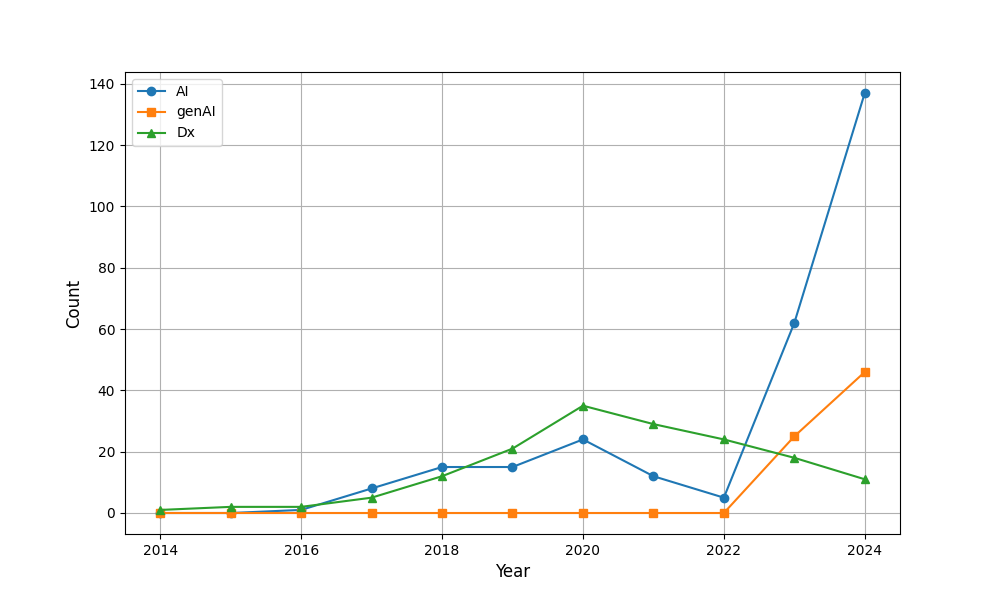

# Educause Data Extraction and Analysis

Nobu C. Shirai

This repository contains a Jupyter notebook (`educause_data_extraction_and_analysis.ipynb`) designed to:

1. **Download HTML content** from a list of EDUCAUSE conference URLs organized by year.
2. **Parse and extract specific sections** of HTML (`<div class="g-primary">` or the entire HTML if not present).
3. **Search for occurrences** of various keywords (e.g., AI, generative AI, digital transformation) while excluding certain words.
4. **Generate CSV** summaries of how many files match the keywords for each year.
5. **Visualize the data** to produce simple line plots comparing keyword frequencies over time.



## Features

- **HTML Downloading**: Automates pulling HTML pages from URLs in a CSV file.
- **Parsing & Extraction**: Extracts relevant sections (`<div class="g-primary">`) and saves them locally.
- **Keyword Analysis**:
  - Searches for terms like "AI", "artificial intelligence", "Dx", "digital transformation", and more.
  - Excludes false positives using a curated list of `EXCLUDED_WORDS`.
- **Year-by-Year Aggregation**: Organizes downloaded files into `html_{year}` folders and counts keyword occurrences.
- **CSV Generation**: Produces a single CSV file containing the yearly counts.
- **Visualization**: Generates line plots (e.g., PNG or PDF) of these keyword trends.

## Getting Started

### 1. Clone the Repository

```bash
git clone https://github.com/gptdialogues/educause-keyword-counter.git
cd educause-keyword-counter
```

### 2. Create a Virtual Environment (Optional, Recommended)

```bash
python3 -m venv venv4educause
source venv4educause/bin/activate
```

On Windows:
```powershell
python -m venv venv4educause
.\venv4educause\Scripts\activate
```

### 3. Install Dependencies

```bash
pip install -r requirements.txt
```

### 4. Prepare Your CSV File

Create or update the file `educause_agenda_url_list.csv` in the repo’s root directory. Each row should have the year and url columns:
```
2000,https://events.educause.edu/annual-conference/2000/proceedings/seminar-6f--creating-knowledge-management-portals-on-your-desktop-with-microsoft-office-2000
2001,https://events.educause.edu/annual-conference/2001/proceedings/the-educause-center-for-analysis-and-research-ecar
2002,https://events.educause.edu/annual-conference/2002/proceedings/bringing-rd-into-the-it-organization
2003,https://events.educause.edu/annual-conference/2003/proceedings/building-a-champagne-internet2-network-on-a-beer-budget
...
```

### 5. Run the Script

You can run the main Python script to download HTML, count keywords, and produce a plot:

```bash
python educause_data_extraction_and_analysis.py
```

By default, it will:
1. Download all HTML for each year (uncomment the line in `if __name__ == "__main__":` to enable downloading).
2. Count keyword occurrences for years 2000–2024.
3. Save a CSV named `keyword_count.csv`.
4. Generate a visualization from 2014 onward, saved as `keyword_count.png`.

### 6. Customize Analysis

- **Search Scope**: The script currently checks both `<h1>` and `<div class="rte-section">` for keyword matches. Adjust `scope` (e.g., `"title_only"`) if you only want to search within certain sections.
- **Search Words**: To add or remove excluded words, modify the `EXCLUDED_WORDS` list.  
- **Visualization**: Change marker styles, fonts, or other parameters in the `do_visualize()` function.

## Repository Structure

```
educause-keyword-counter/
├── README.md
├── requirements.txt
├── educause_data_extraction_and_analysis.ipynb
├── educause_data_extraction_and_analysis.py
├── educause_agenda_url_list.csv
├── educause_agenda_url_list_minimum.csv 
├── keyword_count.csv
├── keyword_count.png
├── Summary_of_ChatGPT_output.md
├── ChatGPT_output/
└── individual_scripts/
```

- `educause_agenda_url_list.csv` contains the list of EDUCAUSE conference URLs from 2000–2024.
- `educause_agenda_url_list_minimum.csv` contains the minimum set of URLs to reproduce the analysis.
- `keyword_count.csv` and `keyword_count.png` are the output files of `educause_data_extraction_and_analysis.py`. The CSV file contains the keyword counts for each year, and the PNG file contains a line plot of the keyword counts.
- `educause_data_extraction_and_analysis.ipynb` is a Jupyter notebook version of the Python script.
- `educause_data_extraction_and_analysis.py` is the main Python script.
- `Summary_of_ChatGPT_output.md` contains a summary of the ChatGPT outputs in `ChatGPT_output/` related to this project.
- `ChatGPT_output` contains a markdown file with a dialogue between ChatGPT and the user.
- `individual_scripts` contains individual scripts before they were combined into `educause_data_extraction_and_analysis.py`.


## Acknowledgement of AI Contribution

This repository contains code that has been generated, enhanced, or inspired by OpenAI's ChatGPT 4o and o1. GitHub Copilot was also used to generate code snippets. The dialogue with ChatGPT is saved as a markdown file within `ChatGPT_output`.

## License

This project is licensed under the [MIT License](LICENSE).  
